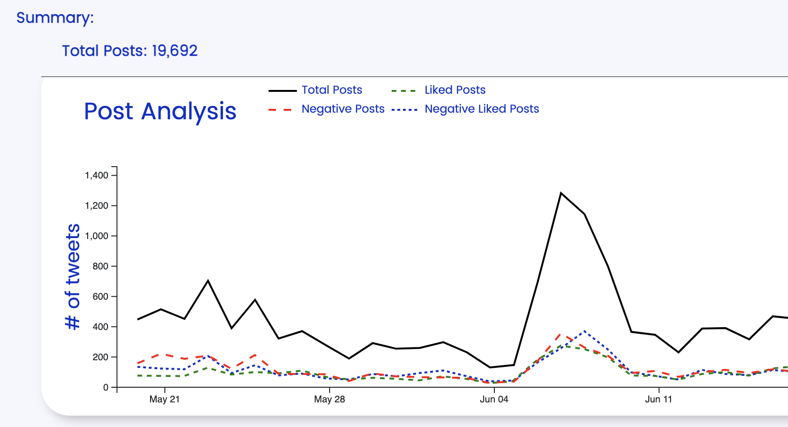

# AI Political Consultants 

## Table of Contents

- [AI Political Consultants ](#ai-political-consultants-)
  - [Table of Contents](#table-of-contents)
  - [Description](#description)
  - [Installation](#installation)
  - [Usage](#usage)
  - [Testing](#testing)
  - [License](#license)
  - [Questions](#questions)

## Description

This application is designed to help spin political sentiment online. It is built with a Next.js front end and a Python back end. The application uses a sentiment analysis algorithm to track political sentiment online and provide a dashboard for users to track sentiment over time. It uses an OpenAI wrapper to generate positve respones to negative tweets.

## Installation

No installation necessary, navigate to https://ai-political-consultant.vercel.app/ to view the deployed site

## Usage

Search from a list of political candidates, select platform and filters to view data on how candidates are trending on various social media platforms

## Testing

There are some functional tests that can be used at https://ai-political-consultant.vercel.app/test

## License

This application is designed to help spin political sentiment online. It is built with a Next.js front end and a Python back end. The application uses a sentiment analysis algorithm to track political sentiment online and provide a dashboard for users to track sentiment over time. It uses an OpenAI wrapper to generate positve respones to negative tweets.

## Questions

Philip Scott Neumann

https://github.com/moviefan322

philipscottneumann0@gmail.com
